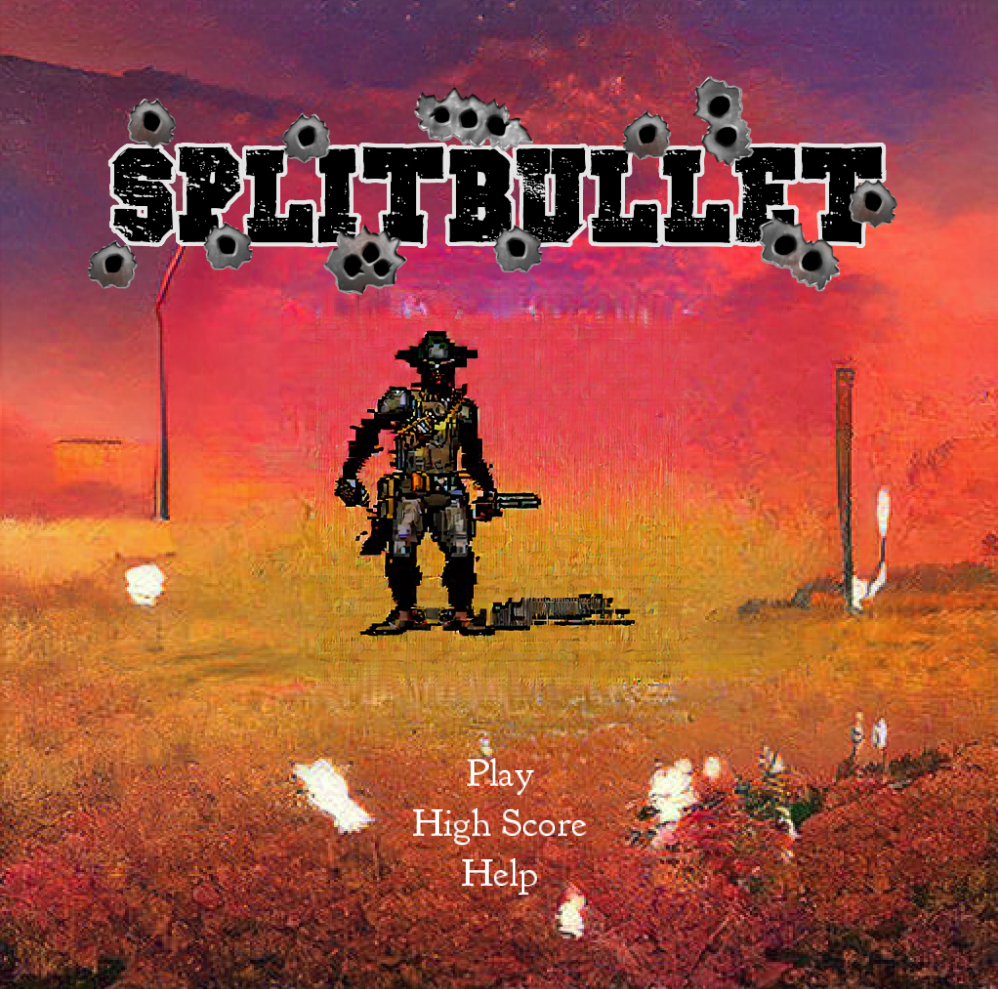
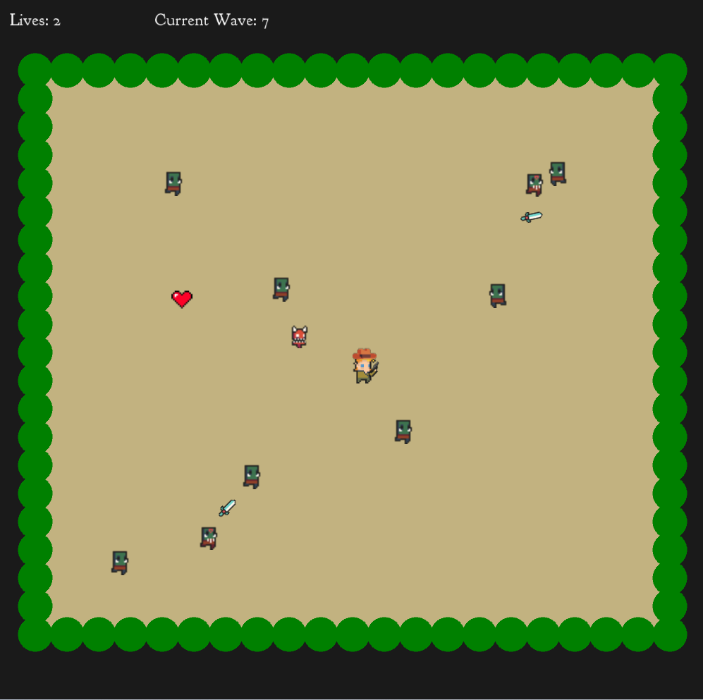

# SplitBullet
A small videogame created for the final of the UT Elements of Graphics class.

Title Screen             |  Gameplay
:-------------------------:|:-------------------------:
  |  

SplitBullet is a small game that is loosely based off of Stardew Valley's [Journey of the Prairie King](https://stardewvalleywiki.com/Journey_of_the_Prairie_King). In this game (created entirely in the Processing language), the player controls a pistol-weilding character whose main objective is to survive as many waves of enemies as possible. During their survival quest, they will encounter fast enemies, slow enemies, powerups, and a variety of bosses. 

## How to Play
### Download
To first play the game, you must download the Processing language and the code in this repository. This can be achieved by downloading Processing from ([https://processing.org/download](https://processing.org/download)) and then cloning this repository ([https://github.com/Randy-Hodges/SplitBullet](https://github.com/Randy-Hodges/SplitBullet)). After downloading the code, ensure that you have the minim library installed by entering the Processing app and then going to (in the top bar) Sketch->Import Library->Add Library and then searching for "minim". After that you are ready to play.
### Play
Once the code is downloaded, you can press the run button (circular play icon) from the Processing editor and the game will launch. Once in the game, you can use the mouse to select options from the main menu. When you press the 'play' button, the waves of enemies will begin. You can use the AWSD keys to move and the mouse to shoot. Additionally you can press the 'p' key to pause the game, 'm' while paused to mute the game, and 'esc' to quit the entire program.
